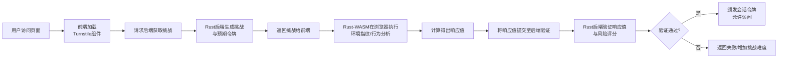

自己实现一个类似 Cloudflare Turnstile 的人机验证组件是一个非常有挑战性但也极具价值的项目。基于你的需求（TypeScript + Rust，达到 80% 的能力），我为你设计了一个**可行、高效且分层可靠**的方案。

这个方案的核心思想是：**用 Rust 处理核心计算与安全敏感逻辑（编译为 WASM 前端运行 + 后端原生服务），用 TypeScript 构建用户交互界面与 API 网关**，并通过多层验证机制组合来逼近 Turnstile 的效果。

### 🧠 核心架构与工作流

首先，通过一个流程图来理解整个系统的运作方式，这是方案的骨架：



---

### 🧱 分层验证策略（达到 80% 效果的关键）

单一验证方式容易被绕过，组合拳才是王道。以下是按优先级和实现难度排序的验证层，你可以组合使用。

| 验证层 | 核心目的 | 实现方式 (Rust/TS) | 检测能力 | 实现难度 |
| :--- | :--- | :--- | :--- | :--- |
| **1. 环境指纹** | 识别自动化工具 | **Rust-WASM**: 收集Canvas、WebGL、音频指纹、字体列表、屏幕分辨率、时区等。【turn0search2】 | 无头浏览器 (Puppeteer/Playwright)、模拟器 | ★★★☆☆ |
| **2. 行为分析** | 识别非人类交互 | **TypeScript**: 记录鼠标移动轨迹、点击频率、滚动速度、键盘按键时长。**Rust-WASM**: 分析轨迹平滑度、停顿模式。 | 简单脚本、宏命令 | ★★★★☆ |
| **3. 挑战-响应** | 证明客户端计算能力 | **Rust-WASM**: 求解一个计算密集型数学题（如SHA-256哈希前导零）或解析一个动态生成的图像。【turn0search3】 | 低级僵尸网络、基础脚本 | ★★☆☆☆ |
| **4. 风险评分** | 综合决策 | **Rust后端**: 综合上述所有信号、IP信誉、请求频率等，计算一个0-100的风险分。超过阈值则拦截。 | 整合所有信号，灵活决策 | ★★★☆☆ |

> 💡 **实现建议**：优先实现 **挑战-响应**（核心防护）和 **环境指纹**（高性价比）。**行为分析**可作为增强项，**风险评分**是最终决策大脑。

---

### 🛠️ 技术实现方案

#### 1. Rust 核心 (编译为 WebAssembly + 后端服务)
这是整个系统的安全基石，负责最核心的逻辑。

<details>
<summary><strong>🔧 Rust 核心代码结构 (点击展开)</strong></summary>

```rust
// src/lib.rs (WASM 前端部分)
use wasm_bindgen::prelude::*;
use web_sys::{window, Document, HtmlCanvasElement};

#[wasm_bindgen]
pub struct ChallengeEngine {
    // 存储环境指纹、行为数据等
    fingerprint: String,
    mouse_data: Vec<(f64, f64, f64)>, // (x, y, timestamp)
}

#[wasm_bindgen]
impl ChallengeEngine {
    #[wasm_bindgen(constructor)]
    pub fn new() -> Self {
        // 初始化，开始收集数据
        ChallengeEngine {
            fingerprint: String::new(),
            mouse_data: Vec::new(),
        }
    }

    // 收集环境指纹
    pub fn collect_fingerprint(&mut self) -> String {
        let document: Document = window().unwrap().document().unwrap();
        
        // 1. Canvas 指纹
        let canvas: HtmlCanvasElement = document.create_element("canvas").unwrap().dyn_into().unwrap();
        let ctx = canvas.get_context("2d").unwrap().unwrap();
        // ... 绘制文本和图形，获取 toDataURL() 的哈希
        
        // 2. WebGL 指纹 (渲染器信息)
        // 3. 音频上下文指纹
        // 4. 字体检测
        
        // 组合成一个唯一的指纹字符串
        let combined_fingerprint = format!("canvas:{};webgl:{};fonts:{}", ...);
        self.fingerprint = combined_fingerprint.clone();
        combined_fingerprint
    }

    // 记录鼠标移动 (从JS调用)
    pub fn record_mouse_move(&mut self, x: f64, y: f64) {
        let timestamp = js_sys::Date::now();
        self.mouse_data.push((x, y, timestamp));
    }

    // 生成挑战并求解 (核心逻辑)
    pub fn solve_challenge(&self, server_challenge: &str) -> String {
        // 1. 验证 server_challenge 的有效性
        // 2. 使用服务端挑战 + 客户端指纹 + 行为数据 作为种子
        let seed = format!("{}:{}:{}", server_challenge, self.fingerprint, self.serialize_mouse_data());
        
        // 3. 计算密集型任务：寻找一个nonce，使得 SHA256(seed + nonce) 有特定前缀
        // 这证明了客户端确实进行了计算
        let target_prefix = "0000"; // 难度可调
        let mut nonce = 0u64;
        loop {
            let hash = sha256(format!("{}:{}", seed, nonce));
            if hash.starts_with(target_prefix) {
                return format!("{}:{}", nonce, hash);
            }
            nonce += 1;
        }
    }
    
    // ... 其他辅助函数
}

// src/main.rs (后端服务部分)
use actix_web::{web, App, HttpServer, HttpResponse};
use serde::{Deserialize, Serialize};
use std::collections::HashMap;
use std::sync::Mutex;

// 验证请求结构
#[derive(Deserialize)]
struct VerifyRequest {
    challenge_response: String,
    site_key: String,
    // 可以包含IP等其他信息
}

// 验证响应结构
#[derive(Serialize)]
struct VerifyResponse {
    success: bool,
    score: f32, // 风险评分 0-100
    reason: String,
}

// 简单的内存缓存 (生产环境用Redis)
struct AppState {
    challenges: Mutex<HashMap<String, String>>, // challenge -> expected_hash
    // 可以加入IP频率限制等
}

async fn get_challenge(data: web::Data<AppState>) -> HttpResponse {
    // 生成一个随机挑战字符串
    let challenge = generate_random_string(32);
    // 计算预期的哈希值 (用于后端验证)
    let expected_hash = compute_expected_hash(&challenge);
    
    // 存储挑战 (设置TTL)
    data.challenges.lock().unwrap().insert(challenge.clone(), expected_hash);
    
    HttpResponse::Ok().json(serde_json::json!({
        "challenge": challenge,
        "expires_at": chrono::Utc::now() + chrono::Duration::minutes(5)
    }))
}

async fn verify_response(
    req: web::Json<VerifyRequest>,
    data: web::Data<AppState>,
) -> HttpResponse {
    // 1. 从缓存中获取并移除挑战
    let expected_hash = {
        let mut challenges = data.challenges.lock().unwrap();
        challenges.remove(&req.site_key)
    };
    
    let expected_hash = match expected_hash {
        Some(hash) => hash,
        None => return HttpResponse::BadRequest().json(VerifyResponse {
            success: false,
            score: 100.0,
            reason: "Invalid or expired challenge".to_string(),
        }),
    };
    
    // 2. 验证客户端的响应
    let client_hash = req.challenge_response.split(':').nth(1).unwrap();
    if client_hash != expected_hash {
        return HttpResponse::Ok().json(VerifyResponse {
            success: false,
            score: 95.0,
            reason: "Invalid challenge response".to_string(),
        });
    }
    
    // 3. 综合评估 (这里可以加入更多逻辑，如IP分析)
    let score = calculate_risk_score(&req, &data); // 你自己实现的函数
    
    HttpResponse::Ok().json(VerifyResponse {
        success: score < 70.0, // 阈值可配置
        score,
        reason: if score < 70.0 { "Verification passed".to_string() } else { "High risk detected".to_string() },
    })
}
```
</details>

**关键点说明**：
*   **`collect_fingerprint`**: 收集多种浏览器特征，组合成一个难以伪造的指纹。【turn0search2】
*   **`solve_challenge`**: 实现了**计算证明**。服务端给出一个挑战，客户端必须通过计算（找哈希前导零）来证明它是真实的浏览器而非脚本。**这能有效阻止低成本的自动化攻击**。【turn0search3】
*   **后端验证**: 服务器不信任客户端，它会**自己计算预期的哈希值**，并与客户端提交的响应进行比对，确保挑战被正确求解。

#### 2. TypeScript 前端 (集成与交互)
负责与Rust-WASM模块通信、渲染UI、管理验证流程。

<details>
<summary><strong>🎯 TypeScript 集成代码 (点击展开)</strong></summary>

```typescript
// src/TurnstileWidget.tsx
import React, { useEffect, useRef, useState } from 'react';
import init, { ChallengeEngine } from '../pkg/your_wasm_package'; // 编译后的WASM包

interface Props {
    siteKey: string;
    onVerify: (token: string) => void;
    onError: (error: string) => void;
}

const TurnstileWidget: React.FC<Props> = ({ siteKey, onVerify, onError }) => {
    const [status, setStatus] = useState<'loading' | 'ready' | 'verifying' | 'success' | 'error'>('loading');
    const engineRef = useRef<ChallengeEngine | null>(null);

    useEffect(() => {
        // 1. 初始化WASM模块
        async function initWasm() {
            try {
                await init(); // 加载wasm_pack生成的JS胶水代码
                engineRef.current = new ChallengeEngine();
                setStatus('ready');
                
                // 2. 获取挑战
                fetchChallenge();
            } catch (e) {
                console.error('Failed to load WASM:', e);
                onError('WASM initialization failed');
                setStatus('error');
            }
        }
        
        initWasm();

        // 3. 监听鼠标移动 (行为分析)
        const handleMouseMove = (e: MouseEvent) => {
            if (engineRef.current && status === 'ready') {
                engineRef.current.record_mouse_move(e.clientX, e.clientY);
            }
        };
        window.addEventListener('mousemove', handleMouseMove);

        return () => {
            window.removeEventListener('mousemove', handleMouseMove);
        };
    }, [siteKey]);

    const fetchChallenge = async () => {
        try {
            const response = await fetch('/api/turnstile/challenge', {
                method: 'POST',
                headers: { 'Content-Type': 'application/json' },
                body: JSON.stringify({ siteKey }),
            });
            const data = await response.json();
            
            if (!data.challenge) throw new Error('No challenge received');
            
            // 4. 收集指纹并求解挑战
            const fingerprint = engineRef.current!.collect_fingerprint();
            const challengeResponse = engineRef.current!.solve_challenge(data.challenge);
            
            // 5. 提交验证结果
            verifyChallenge(challengeResponse);
        } catch (error) {
            console.error('Challenge failed:', error);
            onError('Challenge generation failed');
            setStatus('error');
        }
    };

    const verifyChallenge = async (response: string) => {
        setStatus('verifying');
        try {
            const verifyResponse = await fetch('/api/turnstile/verify', {
                method: 'POST',
                headers: { 'Content-Type': 'application/json' },
                body: JSON.stringify({
                    challengeResponse: response,
                    siteKey,
                    // 可以添加更多上下文信息
                }),
            });
            const result = await verifyResponse.json();
            
            if (result.success) {
                setStatus('success');
                // 6. 验证成功，将令牌传给父组件
                onVerify(result.token || 'success-token'); // 实际应返回JWT等
            } else {
                setStatus('error');
                onError(result.reason || 'Verification failed');
                // 可以选择重新获取挑战或显示错误
            }
        } catch (error) {
            console.error('Verification failed:', error);
            onError('Network error during verification');
            setStatus('error');
        }
    };

    return (
        <div className="turnstile-widget">
            {status === 'loading' && <div>Loading security check...</div>}
            {status === 'ready' && <div>Click to verify you are human</div>}
            {status === 'verifying' && <div>Verifying... <Spinner /></div>}
            {status === 'success' && <div style={{ color: 'green' }}>✓ Verified</div>}
            {status === 'error' && <div style={{ color: 'red' }}>✗ {onError} <button onClick={fetchChallenge}>Retry</button></div>}
        </div>
    );
};

export default TurnstileWidget;
```
</details>

**关键点说明**：
*   **`init()`**: 使用 `wasm-pack` 将 Rust 编译为 WebAssembly，并提供 JS 绑定。
*   **事件监听**: 在 `useEffect` 中监听鼠标移动，将数据传递给 Rust 引擎进行行为分析。
*   **状态管理**: 清晰地管理组件状态（加载、就绪、验证中、成功、失败），并给用户相应反馈。

#### 3. 后端 API 网关 (Rust)
提供挑战端点 (`/challenge`) 和验证端点 (`/verify`)，是前端与核心逻辑的桥梁。

<details>
<summary><strong>⚙️ 后端API实现要点 (点击展开)</strong></summary>

```rust
// 已在上方 Rust 代码中展示核心逻辑
// 关键在于 AppState 的设计和挑战的生命周期管理

// 1. 使用 Redis 替代内存 HashMap 存储挑战和频率限制
// 2. 挑战应设置合理的TTL (如5分钟)
// 3. 验证端点应：
//    - 验证挑战是否存在且未过期
//    - 验证响应哈希是否正确
//    - 综合计算风险评分 (可集成IP信誉库)
//    - 颁发短期有效的JWT令牌给前端
// 4. 考虑速率限制，防止单IP滥用
```
</details>

---

### 📊 性能与安全考量

| 方面 | 策略 | 说明 |
| :--- | :--- | :--- |
| **⚡ 性能优化** | **WASM 预加载** | 在页面加载早期异步加载WASM模块，减少用户等待时间。【turn0search4】 |
| | **挑战缓存** | 后端可预生成一批挑战并缓存，减少实时生成开销。 |
| | **异步处理** | 前端验证过程异步进行，不阻塞主线程，提升用户体验。 |
| **🛡️ 安全加固** | **HTTPS 强制** | 所有通信必须通过HTTPS，防止中间人攻击。 |
| | **SameSite Cookie** | 设置 `SameSite=Lax` 或 `Strict`，防止CSRF攻击。 |
| | **IP 信誉** | 集成开源IP信誉数据库，对已知恶意IP提高挑战难度或直接拦截。 |
| | **令牌有效期** | 验证成功后颁发的令牌应设置短有效期（如15-30分钟），并存储在HttpOnly Cookie中。 |

---

### 🚀 部署与实现路线图

1.  **第一阶段（核心MVP）**：
    *   实现 **Rust-WASM 的挑战-响应** 机制（`solve_challenge`）和 **后端验证**。
    *   实现简单的 **TypeScript 前端组件**，完成基本流程。
    *   **目标**：能阻止90%的简单脚本和自动化工具。

2.  **第二阶段（增强指纹）**：
    *   在 Rust-WASM 中实现完整的 **环境指纹收集**（Canvas, WebGL, 字体等）。
    *   将指纹作为挑战计算的一部分，增加伪造难度。
    *   **目标**：能有效识别无头浏览器和模拟器。

3.  **第三阶段（行为与智能）**：
    *   实现 **鼠标/键盘行为分析**，计算交互的“人性化”评分。
    *   在后端引入 **简单的风险评分模型**，综合所有信号。
    *   **目标**：达到80%的Turnstile防护能力，能应对更复杂的攻击。

4.  **第四阶段（生产就绪）**：
    *   用 **Redis** 替代内存存储，实现分布式部署。
    *   添加 **管理后台**，监控验证成功率、拦截率、风险评分分布。
    *   完善 **错误处理**、**日志** 和 **监控**。

> ⚠️ **重要提醒**：
> *   **合规性**：确保你的验证机制符合GDPR等隐私法规，明确告知用户数据收集用途。
> *   **持续演进**：攻击手法在不断进化，你的验证系统也需要持续更新和调整策略。
> *   **用户体验**：在安全与体验间平衡。过于复杂的验证会流失真实用户。

这个方案为你提供了一个**坚实、可扩展且高性能**的基础。通过Rust处理核心安全逻辑，TypeScript处理交互，你能构建出一个既安全又灵活的验证系统。从挑战-响应开始，逐步加入指纹和行为分析，你就能稳步达到80%甚至更高的防护能力。
